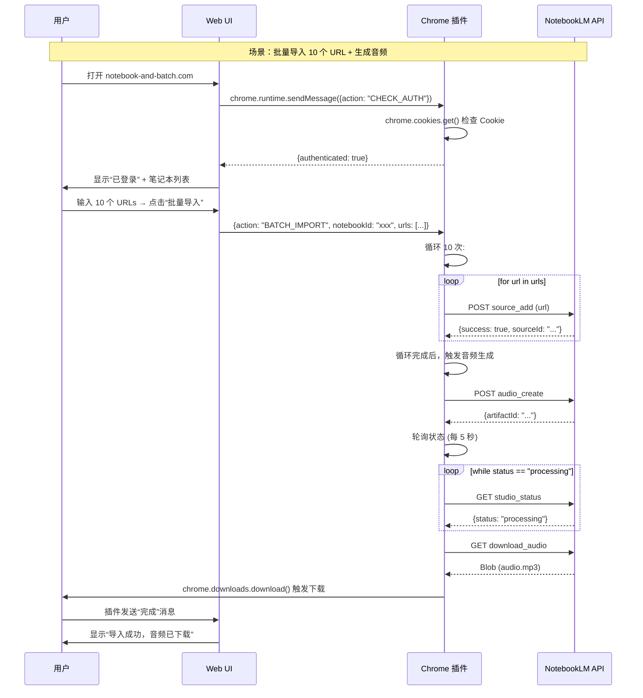

# Notebook and Batch：完整产品规格说明书 (Spec)

> **版本**：1.0.0  
> **日期**：2026-05-31  
> **架构**：Chrome Extension + Web UI (纯前端，运算在用户本地)  
> **核心理念**：用户只需安装一次 Chrome 插件，即可在 Web 界面上批量操作 NotebookLM，无需安装 Python/CLI/本地服务器。

***

## 1. 产品概述

### 1.1 产品名称
**Notebook and Batch**

### 1.2 核心价值主张
> “批量导入导出 NotebookLM 内容，无需安装任何命令行工具。只需安装 Chrome 插件，打开网页即可开始。”

### 1.3 目标用户
| 用户类型 | 痛点 | 需求 |
|---|---|---|
| **研究人员** | 手动添加 20+ 来源太慢 | 批量导入 URLs |
| **内容创作者** | 生成播客后下载麻烦 | 批量生成 + 一键下载 |
| **SEO/产品经理** | 竞品分析需反复操作 | 自动化工作流（导入→查询→生成→下载） |
| **教育工作者** | 培训材料需多次制作 | 批量生成测验/闪卡/音频 |

### 1.4 竞品对比

| 方案 | 需要安装 | 需要 CLI | 需要本地服务器 | 数据隐私 |
|---|---|---|---|---|
| **NotebookLM Web Importer (现有插件)** | ✅ Chrome 插件 | ❌ | ❌ | ✅ 本地 |
| **notebooklm-mcp-cli (现有 CLI)** | ✅ Python + CLI | ✅ | ❌ | ✅ 本地 |
| **Notebook and Batch (本方案)** | ✅ Chrome 插件 | ❌ | ❌ | ✅ 本地 |
| **你的后端托管方案** | ❌ | ❌ | ✅ (你托管) | ❌ Cookie 在你这 |

**本方案优势**：唯一同时满足 **“只装插件” + “无需 CLI” + “数据本地”** 的方案。

***

## 2. 系统架构

### 2.1 整体架构图

```
┌─────────────────────────────────────────────────────────────────────────┐
│                              用户浏览器                                  │
│                                                                          │
│  ┌──────────────────────────────────────────────────────────────────┐  │
│  │                   Web UI (notebook-and-batch.com)                │  │
│  │                   Next.js 14 + Tailwind CSS                      │  │
│  │                                                                  │  │
│  │  ╔══════════════════════════════════════════════════════════╗   │  │
│  │  ║  组件列表                                                  ║   │  │
│  │  ╠══════════════════════════════════════════════════════════╣   │  │
│  │  ║  - 登录状态检测 (检查插件是否已安装)                       ║   │  │
│  │  ║  - 笔记本列表 (展示所有 NotebookLM 笔记本)                 ║   │  │
│  │  ║  - 批量导入表单 (多 URL 文本框 + 一键导入)                 ║   │  │
│  │  ║  - 批量生成面板 (选择笔记本 + 生成 Audio/Infographic)     ║   │  │
│  │  ║  - 下载管理 (显示已生成文件 + 点击下载)                    ║   │  │
│  │  ║  - 工作流预设 (竞品研究/内容营销/培训材料)                 ║   │  │
│  │  ╚══════════════════════════════════════════════════════════╝   │  │
│  └──────────────────────┬───────────────────────────────────────────┘  │
│                         │                                              │
│                         │ chrome.runtime.sendMessage() (JSON)          │
│                         │ ← 请求：{"action": "...", "data": {...}}     │
│                         │ → 响应：{"success": true, "result": {...}}   │
│                         ↓                                              │
│  ┌──────────────────────────────────────────────────────────────────┐  │
│  │                   Chrome Extension (唯一需要安装)                │  │
│  │                   manifest.json + background.js                  │  │
│  │                                                                  │  │
│  │  ╔══════════════════════════════════════════════════════════╗   │  │
│  │  ║  权限配置 (manifest.json)                                 ║   │  │
│  │  ╠══════════════════════════════════════════════════════════╣   │  │
│  │  ║  permissions: ["cookies", "tabs", "storage", "downloads"]║   │  │
│  │  ║  host_permissions: ["https://notebooklm.google.com/*"]   ║   │  │
│  │  ╚══════════════════════════════════════════════════════════╝   │  │
│  │                                                                  │  │
│  │  ╔══════════════════════════════════════════════════════════╗   │  │
│  │  ║  核心功能 (background.js)                                 ║   │  │
│  │  ╠══════════════════════════════════════════════════════════╣   │  │
│  │  ║  1. Cookie 读取: chrome.cookies.get()                    ║   │  │
│  │  ║  2. API 调用: fetch() 直接调用 NotebookLM 内部 API       ║   │  │
│  │  ║  3. 工作流引擎: 循环/队列/轮询逻辑 (替代 CLI 脚本)       ║   │  │
│  │  ║  4. 文件下载: chrome.downloads.download() + Blob         ║   │  │
│  │  ║  5. 状态监听: 监听生成进度，主动推送 UI                    ║   │  │
│  │  ╚══════════════════════════════════════════════════════════╝   │  │
│  └──────────────────────┬───────────────────────────────────────────┘  │
│                         │ HTTPS + Cookie (SAPSID, GSEP, CSRF)          │
│                         ↓                                              │
│  ┌──────────────────────────────────────────────────────────────────┐  │
│  │                   Google NotebookLM API                          │  │
│  │                   (内部 API，需要 Cookie 认证)                     │  │
│  │                                                                  │  │
│  │  - GET /_/notebooklm/data/notebooks (列表)                       │  │
│  │  - POST /_/notebooklm/data/notebooks (创建)                      │  │
│  │  - POST /_/notebooklm/data/source_add (添加来源)                 │  │
│  │  - POST /_/notebooklm/data/audio_create (生成音频)               │  │
│  │  - GET /_/notebooklm/data/download_audio (下载)                  │  │
│  │  - POST /_/notebooklm/data/query (AI 查询)                        │  │
│  └──────────────────────────────────────────────────────────────────┘  │
│                                                                          │
└─────────────────────────────────────────────────────────────────────────┘
```

### 2.2 数据流向



***

## 3. 功能规格

### 3.1 核心功能列表

| 功能模块 | 子功能 | 优先级 | 说明 |
|---|---|---|---|
| **认证** | 检查登录状态 | 🥇 P0 | `chrome.cookies.get()` 检查 SAPSID |
| | 首次登录引导 | 🥇 P0 | 未登录时引导打开 notebooklm.google.com |
| **笔记本管理** | 列出所有笔记本 | 🥇 P0 | GET notebooks → 表格展示 |
| | 创建新笔记本 | 🥇 P0 | POST notebooks → 输入标题 |
| | 删除笔记本 | 🥈 P1 | DELETE notebooks → 确认弹窗 |
| | 切换笔记本 | 🥇 P0 | 下拉框选择当前操作笔记本 |
| **批量导入** | 多 URL 输入框 | 🥇 P0 | 文本域，每行一个 URL |
| | YouTube URL 支持 | 🥇 P0 | 自动识别 YouTube 链接 |
| | 批量添加来源 | 🥇 P0 | 循环调用 source_add API |
| | 导入进度显示 | 🥇 P0 | 实时显示“已导入 3/10” |
| | 错误重试 | 🥈 P1 | 失败 URL 自动重试 3 次 |
| **批量生成** | 批量生成音频 | 🥇 P0 | 多选笔记本 → 生成 Audio Overview |
| | 批量生成信息图 | 🥈 P1 | 生成 Infographics |
| | 批量生成幻灯片 | 🥈 P1 | 生成 Slide Decks |
| | 批量生成测验 | 🥈 P1 | 生成 Quizzes |
| | 状态轮询 | 🥇 P0 | 每 5 秒轮询生成状态 |
| **文件下载** | 自动触发下载 | 🥇 P0 | `chrome.downloads.download()` |
| | 下载管理 | 🥈 P1 | 显示已生成文件列表 |
| | 批量下载 | 🥈 P1 | 一键下载所有生成的文件 |
| **工作流预设** | 竞品研究 | 🥇 P0 | 导入→查询→生成音频→下载 |
| | 内容营销 | 🥇 P0 | 导入→生成博客→生成社交帖→下载 |
| | 培训材料 | 🥈 P1 | 导入 SOP→生成测验/闪卡→下载 |
| **AI 查询** | 单笔记本查询 | 🥇 P0 | 输入问题 → AI 回答 |
| | 跨笔记本查询 | 🥉 P2 | 多个笔记本联合查询 |

### 3.2 用户界面规格

#### 3.2.1 主页布局

```
┌─────────────────────────────────────────────────────────────────┐
│  Notebook and Batch                                  [登录状态]  │
├─────────────────────────────────────────────────────────────────┤
│                                                                 │
│  📊 概览                                                        │
│  ┌─────────────┐ ┌─────────────┐ ┌─────────────┐              │
│  │ 笔记本数量  │ │ 来源总数    │ │ 待下载文件  │              │
│  │     12      │ │     86      │ │      3      │              │
│  └─────────────┘ └─────────────┘ └─────────────┘              │
│                                                                 │
│  📚 笔记本列表 (下拉选择当前操作)                                │
│  ┌───────────────────────────────────────────────────────────┐ │
│  │ [▼] Competitor Analysis - Q2 2026              [创建 +]    │ │
│  └───────────────────────────────────────────────────────────┘ │
│                                                                 │
│  📥 批量导入                                                    │
│  ┌───────────────────────────────────────────────────────────┐ │
│  │ 每行一个 URL:                                             │ │
│  │ https://example.com/article1                              │ │
│  │ https://youtube.com/watch?v=abc123                        │ │
│  │ https://example.com/article2                              │ │
│  │                                                           │ │
│  │ [批量导入] (显示：已导入 0/3)                              │ │
│  └───────────────────────────────────────────────────────────┘ │
│                                                                 │
│  🎧 批量生成 Audio                                              │
│  ┌───────────────────────────────────────────────────────────┐ │
│  │ ☑ Competitor Analysis - Q2 2026                           │ │
│  │ ☑ Team Training - Onboarding                              │ │
│  │ ☐ Blog Post - AI Trends 2026                              │ │
│  │                                                           │ │
│  │ 长度：[○ 短 ● 长 ○ 中]  格式：[○ 快速 ● 深度分析]         │ │
│  │ [生成音频] (显示：生成中 2/2)                              │ │
│  └───────────────────────────────────────────────────────────┘ │
│                                                                 │
│  📥 下载管理                                                    │
│  ┌───────────────────────────────────────────────────────────┐ │
│  │ ✅ Competitor Analysis - Q2 2026.mp3       [下载]         │ │
│  │ ✅ Team Training - Onboarding.mp3          [下载]         │ │
│  │ ⏳ Blog Post - AI Trends 2026.mp3 (生成中 45%)            │ │
│  └───────────────────────────────────────────────────────────┘ │
│                                                                 │
│  ⚙️ 工作流预设                                                  │
│  [竞品研究] [内容营销] [培训材料] [自定义]                      │
│                                                                 │
└─────────────────────────────────────────────────────────────────┘
```

#### 3.2.2 登录状态检测页

```
┌─────────────────────────────────────────────────────────────────┐
│  Notebook and Batch                                              │
├─────────────────────────────────────────────────────────────────┤
│                                                                 │
│  🔒 未检测到 Chrome 插件                                         │
│                                                                 │
│  ┌───────────────────────────────────────────────────────────┐ │
│  │ 请安装 Chrome 插件以开始使用：                             │ │
│  │                                                           │ │
│  │  1. 点击添加至 Chrome 按钮                                 │ │
│  │  2. 确认安装并授予权限                                    │ │
│  │  3. 打开 notebooklm.google.com 并登录 Google              │ │
│  │  4. 刷新本页面                                            │ │
│  │                                                           │ │
│  │  [添加至 Chrome]                                           │ │
│  └───────────────────────────────────────────────────────────┘ │
│                                                                 │
│  ℹ️ 插件权限说明：                                              │
│  - 读取 notebooklm.google.com 的 Cookie (仅用于认证)            │
│  - 调用 NotebookLM API (批量操作)                              │
│  - 下载文件到本地 (不会上传任何数据)                            │
│                                                                 │
└─────────────────────────────────────────────────────────────────┘
```

***

## 4. 通信协议规格

### 4.1 Web UI → Chrome 插件消息格式

```typescript
// 所有消息通过 chrome.runtime.sendMessage() 发送

interface Message {
  action: string;
  data?: any;
}

// 示例消息
const messages: Record<string, Message> = {
  // 检查认证
  CHECK_AUTH: { action: "CHECK_AUTH" },
  
  // 获取笔记本列表
  LIST_NOTEBOOKS: { action: "LIST_NOTEBOOKS" },
  
  // 创建笔记本
  CREATE_NOTEBOOK: { 
    action: "CREATE_NOTEBOOK", 
    data: { title: "My Notebook", description: "..." } 
  },
  
  // 批量导入
  BATCH_IMPORT: {
    action: "BATCH_IMPORT",
    data: {
      notebookId: "abc123",
      urls: [
        "https://example.com/article1",
        "https://youtube.com/watch?v=xyz"
      ]
    }
  },
  
  // 批量生成音频
  BATCH_AUDIO: {
    action: "BATCH_AUDIO",
    data: {
      notebookIds: ["abc123", "def456"],
      length: "long",
      format: "deep_dive"
    }
  },
  
  // 下载文件
  DOWNLOAD_AUDIO: {
    action: "DOWNLOAD_AUDIO",
    data: {
      notebookId: "abc123",
      artifactId: "xyz789",
      filename: "podcast.mp3"
    }
  },
  
  // 查询笔记本
  QUERY_NOTEBOOK: {
    action: "QUERY_NOTEBOOK",
    data: {
      notebookId: "abc123",
      question: "Summarize the key points"
    }
  }
};
```

### 4.2 Chrome 插件 → Web UI 响应格式

```typescript
interface Response {
  success: boolean;
  data?: any;
  error?: string;
}

// 示例响应
const responses: Record<string, Response> = {
  CHECK_AUTH: {
    success: true,
    data: { authenticated: true, email: "user@gmail.com" }
  },
  
  LIST_NOTEBOOKS: {
    success: true,
    data: {
      notebooks: [
        { id: "abc123", title: "Competitor Analysis", source_count: 10 },
        { id: "def456", title: "Training", source_count: 5 }
      ]
    }
  },
  
  BATCH_IMPORT: {
    success: true,
    data: {
      imported_count: 10,
      failed_count: 0,
      results: [
        { url: "...", success: true, sourceId: "s1" },
        { url: "...", success: true, sourceId: "s2" }
      ]
    }
  },
  
  error_example: {
    success: false,
    error: "Failed to authenticate. Please log in to NotebookLM first."
  }
};
```

### 4.3 实时状态推送

```typescript
// 插件主动推送进度 (通过 chrome.runtime.onMessage)

interface ProgressUpdate {
  type: "PROGRESS_UPDATE";
  data: {
    action: "BATCH_IMPORT" | "BATCH_AUDIO";
    current: number;
    total: number;
    percentage: number;
    status: "processing" | "completed" | "error";
    message: string;
  };
}

// 插件调用
chrome.runtime.sendMessage({
  type: "PROGRESS_UPDATE",
  data: {
    action: "BATCH_IMPORT",
    current: 3,
    total: 10,
    percentage: 30,
    status: "processing",
    message: "导入中：https://example.com/article3"
  }
});
```

***

## 5. Chrome 插件技术规格

### 5.1 manifest.json

```json
{
  "manifest_version": 3,
  "name": "Notebook and Batch - NotebookLM 批量工具",
  "version": "1.0.0",
  "description": "批量导入导出 NotebookLM 内容，无需安装 CLI",
  "permissions": [
    "cookies",
    "tabs",
    "storage",
    "downloads"
  ],
  "host_permissions": [
    "https://notebooklm.google.com/*"
  ],
  "background": {
    "service_worker": "background.js",
    "type": "module"
  },
  "action": {
    "default_popup": "popup.html",
    "default_icon": {
      "16": "icons/icon16.png",
      "48": "icons/icon48.png",
      "128": "icons/icon128.png"
    }
  },
  "icons": {
    "16": "icons/icon16.png",
    "48": "icons/icon48.png",
    "128": "icons/icon128.png"
  },
  "commands": {
    "open-notebooklm": {
      "suggested_key": { "default": "Alt+Shift+N" },
      "description": "打开 NotebookLM"
    }
  }
}
```

### 5.2 background.js (核心逻辑)

```javascript
// background.js - Chrome 插件主逻辑

// ========== 工具函数：读取 Cookie ==========
async function getNotebookLmCookie(name) {
  return new Promise((resolve, reject) => {
    chrome.cookies.get({
      url: "https://notebooklm.google.com",
      name: name
    }, (cookie) => {
      if (chrome.runtime.lastError) {
        reject(new Error(chrome.runtime.lastError.message));
      } else if (cookie) {
        resolve(cookie.value);
      } else {
        reject(new Error(`Cookie ${name} not found`));
      }
    });
  });
}

async function getAuthCookies() {
  constsapSID = await getNotebookLmCookie('SAPSID');
  const GSEP = await getNotebookLmCookie('GSEP');
  return { SAPSID, GSEP };
}

// ========== 工具函数：调用 NotebookLM API ==========
async function callNotebookLmApi(endpoint, method = 'GET', body = null) {
  const { SAPSID, GSEP } = await getAuthCookies();
  
  const headers = {
    'Cookie': `SAPSID=${SAPSID}; GSEP=${GSEP}`,
    'Content-Type': 'application/json'
  };
  
  const options = {
    method,
    headers
  };
  
  if (body) {
    options.body = JSON.stringify(body);
  }
  
  const response = await fetch(
    `https://notebooklm.google.com/_/notebooklm/data${endpoint}`,
    options
  );
  
  if (!response.ok) {
    throw new Error(`API Error: ${response.status}`);
  }
  
  return await response.json();
}

// ========== 核心功能：列出笔记本 ==========
async function listNotebooks() {
  const result = await callNotebookLmApi('/notebooks', 'GET');
  return result.notebooks || [];
}

// ========== 核心功能：创建笔记本 ==========
async function createNotebook(title, description = '') {
  const result = await callNotebookLmApi('/notebooks', 'POST', {
    title,
    description
  });
  return result.notebook;
}

// ========== 核心功能：添加来源 ==========
async function addSource(notebookId, url) {
  const result = await callNotebookLmApi('/source_add', 'POST', {
    notebook_id: notebookId,
    source: {
      type: 'url',
      url: url
    }
  });
  return result.source;
}

// ========== 核心功能：批量导入 ==========
async function batchImport(notebookId, urls) {
  const results = [];
  const total = urls.length;
  
  for (let i = 0; i < urls.length; i++) {
    const url = urls[i];
    try {
      const source = await addSource(notebookId, url);
      results.push({ url, success: true, sourceId: source.id });
      
      // 推送进度
      chrome.runtime.sendMessage({
        type: 'PROGRESS_UPDATE',
        data: {
          action: 'BATCH_IMPORT',
          current: i + 1,
          total,
          percentage: Math.round(((i + 1) / total) * 100),
          status: 'processing',
          message: `已导入 ${i + 1}/${total}: ${url}`
        }
      });
    } catch (error) {
      results.push({ url, success: false, error: error.message });
    }
  }
  
  return {
    success: true,
    imported_count: results.filter(r => r.success).length,
    failed_count: results.filter(r => !r.success).length,
    results
  };
}

// ========== 核心功能：生成音频 ==========
async function createAudio(notebookId, length = 'long', format = 'deep_dive') {
  const result = await callNotebookLmApi('/audio_create', 'POST', {
    notebook_id: notebookId,
    length,
    format
  });
  return result.artifact_id;
}

// ========== 核心功能：轮询音频状态 ==========
async function pollAudioStatus(notebookId, artifactId, interval = 5000, maxAttempts = 60) {
  for (let attempt = 0; attempt < maxAttempts; attempt++) {
    const status = await callNotebookLmApi(`/studio_status?notebook_id=${notebookId}&artifact_id=${artifactId}`, 'GET');
    
    if (status.status === 'completed') {
      return { success: true, artifactId };
    }
    
    if (status.status === 'failed') {
      throw new Error('Audio generation failed');
    }
    
    // 推送进度
    chrome.runtime.sendMessage({
      type: 'PROGRESS_UPDATE',
      data: {
        action: 'BATCH_AUDIO',
        current: attempt,
        total: maxAttempts,
        percentage: Math.round((attempt / maxAttempts) * 100),
        status: 'processing',
        message: `生成中 (${attempt}/${maxAttempts})...`
      }
    });
    
    await new Promise(resolve => setTimeout(resolve, interval));
  }
  
  throw new Error('Timeout: Audio generation took too long');
}

// ========== 核心功能：下载音频 ==========
async function downloadAudio(notebookId, artifactId, filename) {
  const { SAPSID, GSEP } = await getAuthCookies();
  
  const response = await fetch(
    `https://notebooklm.google.com/_/notebooklm/data/download_audio?notebook_id=${notebookId}&artifact_id=${artifactId}`,
    {
      headers: {
        'Cookie': `SAPSID=${SAPSID}; GSEP=${GSEP}`
      }
    }
  );
  
  const blob = await response.blob();
  const url = URL.createObjectURL(blob);
  
  return new Promise((resolve, reject) => {
    chrome.downloads.download({
      url: url,
      filename: filename || `podcast_${notebookId}.mp3`,
      saveAs: false
    }, (downloadId) => {
      if (chrome.runtime.lastError) {
        reject(new Error(chrome.runtime.lastError.message));
      } else {
        resolve({ success: true, downloadId });
      }
    });
  });
}

// ========== 消息监听器 ==========
chrome.runtime.onMessage.addListener((message, sender, sendResponse) => {
  (async () => {
    try {
      switch (message.action) {
        case 'CHECK_AUTH': {
          try {
            await getAuthCookies();
            sendResponse({ success: true, data: { authenticated: true } });
          } catch {
            sendResponse({ success: true, data: { authenticated: false } });
          }
          break;
        }
        
        case 'LIST_NOTEBOOKS': {
          const notebooks = await listNotebooks();
          sendResponse({ success: true, data: { notebooks } });
          break;
        }
        
        case 'CREATE_NOTEBOOK': {
          const notebook = await createNotebook(message.data.title, message.data.description);
          sendResponse({ success: true, data: { notebook } });
          break;
        }
        
        case 'BATCH_IMPORT': {
          const result = await batchImport(message.data.notebookId, message.data.urls);
          sendResponse(result);
          break;
        }
        
        case 'BATCH_AUDIO': {
          const results = [];
          for (const notebookId of message.data.notebookIds) {
            const artifactId = await createAudio(notebookId, message.data.length, message.data.format);
            await pollAudioStatus(notebookId, artifactId);
            await downloadAudio(notebookId, artifactId, `podcast_${notebookId}.mp3`);
            results.push({ notebookId, artifactId, success: true });
          }
          sendResponse({ success: true, data: { results } });
          break;
        }
        
        case 'DOWNLOAD_AUDIO': {
          const result = await downloadAudio(
            message.data.notebookId,
            message.data.artifactId,
            message.data.filename
          );
          sendResponse(result);
          break;
        }
        
        default:
          sendResponse({ success: false, error: `Unknown action: ${message.action}` });
      }
    } catch (error) {
      sendResponse({ success: false, error: error.message });
    }
  })();
  
  return true; // 异步响应
});

// ========== 安装时检查 ==========
chrome.runtime.onInstalled.addListener(async () => {
  console.log('Notebook and Batch extension installed');
  // 可选：打开欢迎页面
  // chrome.tabs.create({ url: 'https://notebook-and-batch.com/welcome' });
});
```

***

## 6. Web UI 技术规格

### 6.1 Next.js 页面结构

```
web/
├── app/
│   ├── layout.tsx          # 全局布局
│   ├── page.tsx            # 主页 (笔记本列表 + 批量导入)
│   ├── login/page.tsx      # 登录引导页
│   ├── notebooks/
│   │   └── [id]/page.tsx   # 笔记本详情页
│   └── workflows/
│       └── page.tsx        # 工作流预设页
├── components/
│   ├── NotebookList.tsx    # 笔记本列表组件
│   ├── BatchImportForm.tsx # 批量导入表单
│   ├── AudioGenerator.tsx  # 音频生成器
│   ├── DownloadManager.tsx # 下载管理器
│   └── ProgressIndicator.tsx # 进度条组件
├── lib/
│   ├── chrome.ts           # Chrome API 封装
│   └── types.ts            # TypeScript 类型定义
└── package.json
```

### 6.2 Chrome API 封装 (lib/chrome.ts)

```typescript
// lib/chrome.ts - Chrome API 封装

export interface ChromeMessage {
  action: string;
  data?: any;
}

export interface ChromeResponse {
  success: boolean;
  data?: any;
  error?: string;
}

export function sendMessage(message: ChromeMessage): Promise<ChromeResponse> {
  return new Promise((resolve, reject) => {
    if (!chrome?.runtime?.sendMessage) {
      reject(new Error('Chrome extension not detected'));
      return;
    }
    
    chrome.runtime.sendMessage(message, (response: ChromeResponse) => {
      if (chrome.runtime.lastError) {
        reject(new Error(chrome.runtime.lastError.message));
      } else {
        resolve(response);
      }
    });
  });
}

export async function checkAuth(): Promise<boolean> {
  const response = await sendMessage({ action: 'CHECK_AUTH' });
  return response.data?.authenticated || false;
}

export async function listNotebooks() {
  const response = await sendMessage({ action: 'LIST_NOTEBOOKS' });
  return response.data?.notebooks || [];
}

export async function batchImport(notebookId: string, urls: string[]) {
  const response = await sendMessage({
    action: 'BATCH_IMPORT',
    data: { notebookId, urls }
  });
  return response;
}

export async function batchAudio(notebookIds: string[], length: string, format: string) {
  const response = await sendMessage({
    action: 'BATCH_AUDIO',
    data: { notebookIds, length, format }
  });
  return response;
}

// 监听实时进度
export function onProgressUpdate(callback: (update: any) => void) {
  chrome.runtime.onMessage.addListener((message) => {
    if (message.type === 'PROGRESS_UPDATE') {
      callback(message.data);
    }
  });
}
```

### 6.3 主页组件示例 (app/page.tsx)

```tsx
'use client';
import { useState, useEffect } from 'react';
import { checkAuth, listNotebooks, batchImport, batchAudio, onProgressUpdate } from '@/lib/chrome';

export default function Home() {
  const [authenticated, setAuthenticated] = useState(false);
  const [notebooks, setNotebooks] = useState<any[]>([]);
  const [selectedNotebook, setSelectedNotebook] = useState<string>('');
  const [urls, setUrls] = useState('');
  const [importProgress, setImportProgress] = useState<{current: number, total: number}>({ current: 0, total: 0 });
  const [loading, setLoading] = useState(true);

  useEffect(() => {
    checkAuthStatus();
    onProgressUpdate((update) => {
      if (update.action === 'BATCH_IMPORT') {
        setImportProgress({ current: update.current, total: update.total });
      }
    });
  }, []);

  async function checkAuthStatus() {
    const auth = await checkAuth();
    setAuthenticated(auth);
    if (auth) {
      const notebooks = await listNotebooks();
      setNotebooks(notebooks);
      if (notebooks.length > 0) {
        setSelectedNotebook(notebooks[0].id);
      }
    }
    setLoading(false);
  }

  async function handleBatchImport() {
    const urlList = urls.split('\n').filter(u => u.trim());
    if (!selectedNotebook || urlList.length === 0) return;
    
    const result = await batchImport(selectedNotebook, urlList);
    if (result.success) {
      alert(`导入成功！已导入 ${result.imported_count}/${urlList.length} 个来源`);
      setUrls('');
      checkAuthStatus(); // 刷新列表
    } else {
      alert(`导入失败：${result.error}`);
    }
  }

  if (loading) return <div>加载中...</div>;

  if (!authenticated) {
    return (
      <div className="min-h-screen flex items-center justify-center bg-gray-50">
        <div className="text-center">
          <h1 className="text-3xl font-bold mb-4">Notebook and Batch</h1>
          <p className="text-gray-600 mb-6">请安装 Chrome 插件并登录 NotebookLM</p>
          <a 
            href="https://chromewebstore.google.com/detail/notebook-and-batch" 
            className="bg-blue-600 text-white px-6 py-3 rounded-lg hover:bg-blue-700"
          >
            添加至 Chrome
          </a>
        </div>
      </div>
    );
  }

  return (
    <div className="min-h-screen bg-gray-50">
      <header className="bg-white shadow">
        <div className="max-w-7xl mx-auto px-4 py-6">
          <h1 className="text-3xl font-bold">Notebook and Batch</h1>
          <p className="text-gray-600 mt-2">批量管理 NotebookLM 笔记本</p>
        </div>
      </header>

      <main className="max-w-7xl mx-auto px-4 py-8">
        {/* 笔记本选择 */}
        <div className="bg-white p-6 rounded-lg shadow mb-6">
          <label className="block text-sm font-medium mb-2">选择笔记本</label>
          <select 
            value={selectedNotebook}
            onChange={(e) => setSelectedNotebook(e.target.value)}
            className="w-full p-2 border rounded"
          >
            {notebooks.map(nb => (
              <option key={nb.id} value={nb.id}>{nb.title}</option>
            ))}
          </select>
        </div>

        {/* 批量导入 */}
        <div className="bg-white p-6 rounded-lg shadow mb-6">
          <h2 className="text-xl font-semibold mb-4">批量导入 URLs</h2>
          <textarea
            value={urls}
            onChange={(e) => setUrls(e.target.value)}
            placeholder="每行一个 URL..."
            className="w-full p-2 border rounded mb-4"
            rows={6}
          />
          <button
            onClick={handleBatchImport}
            disabled={importProgress.current > 0}
            className="bg-blue-600 text-white px-6 py-2 rounded hover:bg-blue-700 disabled:bg-gray-400"
          >
            {importProgress.current > 0 
              ? `导入中 ${importProgress.current}/${importProgress.total}`
              : '批量导入'}
          </button>
        </div>

        {/* 概览 */}
        <div className="grid grid-cols-1 md:grid-cols-3 gap-6">
          <div className="bg-white p-6 rounded-lg shadow">
            <h3 className="text-gray-500 text-sm">笔记本数量</h3>
            <p className="text-3xl font-bold">{notebooks.length}</p>
          </div>
        </div>
      </main>
    </div>
  );
}
```

***

## 7. 测试规格

### 7.1 开发环境测试

| 测试项 | 方法 | 工具 |
|---|---|---|
| **插件加载** | `chrome://extensions/` → "加载未打包的扩展" | Chrome |
| **权限检查** | 在插件控制台运行 `chrome.cookies.get()` | Chrome DevTools |
| **通信测试** | Web UI 发送消息 → 插件接收 | `chrome.runtime.sendMessage()` |
| **Cookie 读取** | 手动登录 NotebookLM → 检查 Cookie | `chrome.cookies.get({url: "notebooklm.google.com"})` |
| **API 调用** | 在插件控制台手动调用 API | `callNotebookLmApi('/notebooks')` |

**测试脚本**（在插件控制台运行）：
```javascript
// 测试 Cookie
chrome.cookies.get({
  url: "https://notebooklm.google.com",
  name: "SAPSID"
}, (cookie) => {
  console.log("SAPSID:", cookie?.value);
  console.log("Authenticated:", !!cookie);
});

// 测试笔记本列表
fetch('https://notebooklm.google.com/_/notebooklm/data/notebooks', {
  headers: {
    'Cookie': 'SAPSID=' + cookie.value
  }
}).then(r => r.json()).then(console.log);
```

### 7.2 端到端测试清单

| 测试场景 | 步骤 | 预期结果 |
|---|---|---|
| **首次使用** | 安装插件 → 打开网站 → 检查状态 | 显示"已登录" + 笔记本列表 |
| **批量导入** | 输入 5 个 URLs → 点击导入 | 5 个来源全部添加到笔记本 |
| **批量生成音频** | 选择 3 个笔记本 → 生成音频 | 3 个音频依次生成并下载 |
| **错误处理** | 输入无效 URL → 导入 | 显示错误，其他 URL 继续导入 |
| **断网恢复** | 导入中途断网 → 恢复 | 重试失败项，继续完成 |

### 7.3 API 端点发现（抓包）

**步骤**：
1. 打开 Chrome DevTools → Network
2. 访问 `notebooklm.google.com`
3. 手动添加一个 URL 来源
4. 找到请求：
   - **URL**: `https://notebooklm.google.com/_/notebooklm/data/source_add`
   - **Method**: POST
   - **Headers**: `Cookie`, `Content-Type`
   - **Payload**: `{"notebook_id": "...", "source": {"type": "url", "url": "..."}}`
5. 记录端点、参数，填入 `background.js`

***

## 8. 发布与部署

### 8.1 Chrome Web Store 发布流程

| 步骤 | 操作 | 时间 |
|---|---|---|
| 1 | 准备图标（16/48/128px） | 1 小时 |
| 2 | 编写隐私政策（说明数据仅本地存储） | 1 小时 |
| 3 | 打包插件（zip） | 10 分钟 |
| 4 | 提交 Chrome Web Store | 等待审核（1-3 天） |
| 5 | 发布后更新 URL | 即时 |

**隐私政策模板**：
```markdown
## 隐私政策

Notebook and Batch 不会收集、存储或传输任何用户数据到外部服务器。

- **Cookie**: 仅用于读取 `notebooklm.google.com` 的认证 Cookie，存储在用户浏览器本地
- **API 调用**: 所有请求直接从用户浏览器发送到 Google NotebookLM API
- **文件下载**: 所有文件直接下载到用户本地计算机
- **无数据上传**: 本扩展不向任何第三方服务器发送数据
```

### 8.2 Web UI 部署

| 平台 | 步骤 |
|---|---|
| **Vercel** | `vercel deploy` → 自动部署到 `notebook-and-batch.vercel.app` → 自定义域名 |
| **Cloudflare Pages** | `wrangler pages deploy` → 免费托管 |

***

## 9. 风险与缓解

| 风险 | 可能性 | 影响 | 缓解方案 |
|---|---|---|---|
| NotebookLM API 变更 | 中 | 高 | 抽象 API 层，定期抓包更新 |
| Cookie 过期频繁 | 高 | 中 | 自动检测 + 提示重新登录 |
| 批量请求被限流 | 中 | 中 | 添加延迟（1-2 秒/请求）、队列、错误重试 |
| Chrome 审核失败 | 低 | 高 | 提前准备隐私政策、权限说明、功能演示视频 |
| Google 封禁非官方 API | 中 | 高 | 明确标注"非官方工具，仅供个人使用" |

***

## 10. 项目时间线

### Phase 1：MVP（1 周）

| 任务 | 时间 | 负责人 |
|---|---|---|
| 开发 Chrome 插件（基础功能） | 2 天 | 你 |
| 开发 Web UI 主页 | 2 天 | 你 |
| API 端点抓包确认 | 0.5 天 | 你 |
| 端到端测试 | 0.5 天 | 你 |
| **总计** | **5 天** | |

### Phase 2：功能完善（1 周）

| 任务 | 时间 |
|---|---|
| 批量生成音频 | 2 天 |
| 文件下载管理 | 1 天 |
| 工作流预设（竞品研究） | 2 天 |
| 错误处理 + 重试 | 1 天 |
| **总计** | **6 天** |

### Phase 3：发布（3 天）

| 任务 | 时间 |
|---|---|
| Chrome Web Store 提交 | 1 天 |
| Web UI 部署 | 0.5 天 |
| 用户文档 + 教程视频 | 1 天 |
| 收集反馈 + 快速迭代 | 0.5 天 |
| **总计** | **3 天** |

***

## 11. 成功指标

| 指标 | 3 个月目标 |
|---|---|
| Chrome 插件安装量 | 1,000+ |
| 月活跃用户 | 300+ |
| 用户评分 | 4.5+/5 |
| 平均批量导入数/用户 | 20+ URLs |
| GitHub Star（开源代码） | 100+ |

***

## 12. 下一步行动

1. **今天**：开始抓包分析 NotebookLM API（记录端点、参数）
2. **明天**：开发 Chrome 插件原型（`manifest.json` + `background.js` 基础版）
3. **第 3 天**：开发 Web UI 主页（笔记本列表 + 批量导入表单）
4. **第 4-5 天**：端到端测试 + Bug 修复
5. **第 6 天**：准备 Chrome Web Store 提交材料
6. **第 7 天**：提交审核

需要我立即生成：
1. **完整的 Chrome 插件代码**（`manifest.json` + `background.js` + 图标）
2. **完整的 Web UI 代码**（Next.js 项目框架）
3. **API 端点抓包指南**（详细步骤）

告诉我你需要哪个，我马上生成！